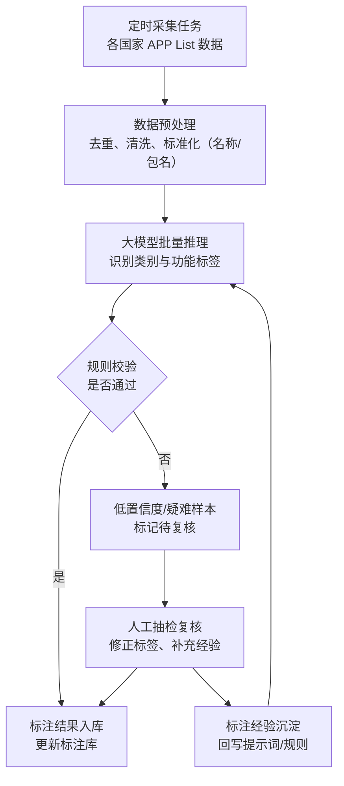
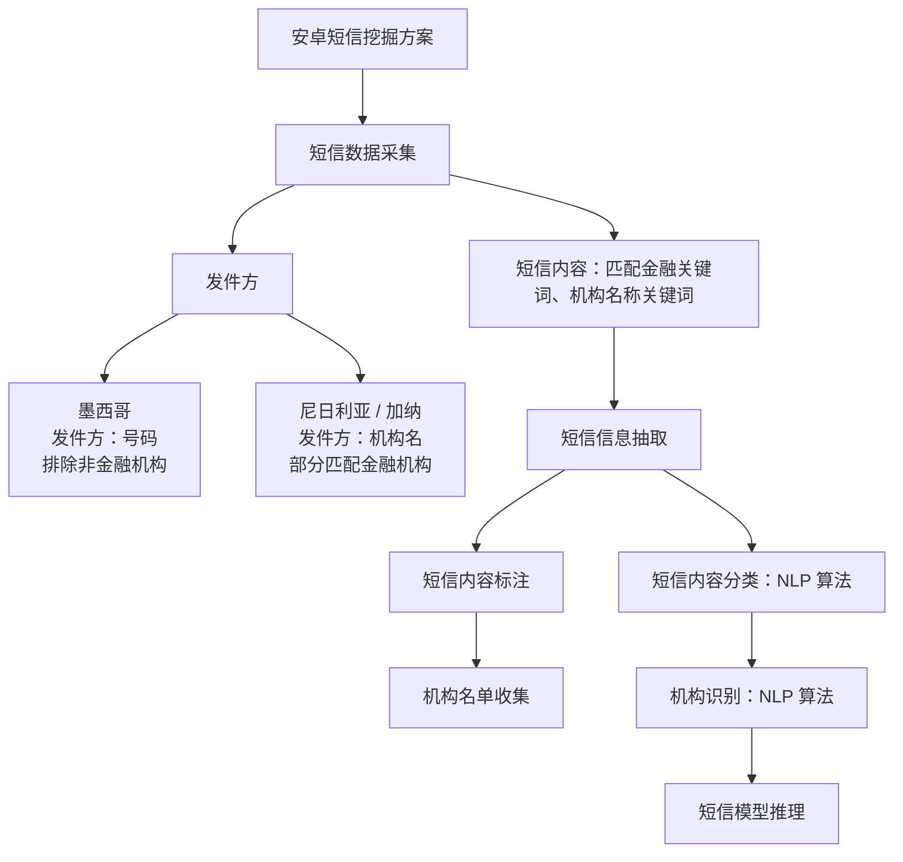

# AI 智能汇报 PPT（完整版：APP List 与短信、银行流水、变量开发 Agent，共 18 页）

请易编辑。不要生成大量小色块、卡片、标签、装饰线条或零碎文本框。每页控制主要元素数量。所有内容保持可编辑，视觉效果与编辑便利冲突时，优先方便后续修改。全篇共 18 页，无封面页；每一页的内容尽量充实，已有数据一律保留、不得删减。

---


# 一、APP List（第 1-3 页）

## 第 1 页：APP 标注的价值——海量且快速变化的 APP List，只有被持续标注才能转化为用户洞察

### 1. 核心观点

APP List 包含丰富的用户行为信息，但原始 APP 名称和包名无法直接用于变量挖掘。由于 APP 数量大、更新快，并且不同国家的 APP 生态差异明显，必须建立持续、稳定的信息抽取和标注能力。

### 2. 数据现状：难点与痛点

- 已覆盖 4 个国家：墨西哥、加纳、尼日利亚、澳大利亚
- 全量去重 APP 数量达到【待补充】万个
- 每月新增 APP 约【待补充】个
- 约 50% 的 APP 在 Google Play 中无法找到或已经下架
- 人工标注效率约为 300 个/天

### 3. 标注价值链路

```text
原始 APP List
→ APP 类别与功能识别
→ 用户行为和需求理解
→ APP 变量挖掘
→ 模型及业务应用
```

**信息抽取示例**

- 原始信息：APP 名称、包名
- 抽取结果：金融类 APP、小额借贷场景、短期资金需求
- 后续应用：形成信贷需求强度等候选变量

### 4. 业务价值

- 更快支持新国家和新产品的数据建设
- 减少重复人工调研和标注投入
- 快速洞察用户画像和潜在需求

### 5. 结论

APP 标注不是一次性的数据整理，而是一项需要跨市场复用、持续更新的数据能力。

---

## 第 2 页：大模型解决方案——从人工识别升级为可复用的批量推理流程

### 1. 核心观点

通过整合定时采集任务和人工标注经验，由大模型进行批量推理，再结合规则校验和人工抽检，可以显著提升标注效率、一致性和跨国家复用能力。

### 2. 流程展示



### 3. 方案对比

| 对比维度 | 人工方式 | 大模型增强方式 |
|---|---|---|
| 处理方式 | 逐个搜索和判断 | 批量推理 |
| 处理效率 | 较低 | 显著提升 |
| 标签口径 | 容易不一致 | 使用统一标签体系 |
| 疑难样本 | 依赖人工逐一判断 | 低置信度结果由人工复核 |
| 跨国家复用 | 新国家需要重复投入 | 主体流程可在多个国家复用 |

---

## 第 3 页：大模型应用效果——标注效率提升与模型增益

### 1. 数据生产效果

- 未识别 APP 比例从【待补充】%下降至【待补充】%
- 单批数据标注处理周期从【待补充】缩短至【待补充】
- 人工标注投入下降【待补充】%
- 人工抽样一致率或标注准确率达到【待补充】%

### 2. 对模型效果的帮助

- 对模型 AUC 的增益：【待补充】
- 进入模型或策略的有效变量：【待补充】个
- APP 子模型的重要度：【待补充】

### 3. 结论

大模型负责批量处理，规则保证底线，人工聚焦疑难样本。最终交付的不只是一批 APP 标签，而是一套能够跨市场复用、持续更新，并转化为模型变量和业务洞察的数据服务能力。

---

# 二、SMS（第 4-6 页）

## 第 4 页：安卓短信挖掘标准化方案

### 1. 方案总览



### 2. 关键环节说明

- 发件方识别：墨西哥按号码识别、排除非金融机构；尼日利亚/加纳按机构名、部分匹配金融机构
- 短信内容识别：匹配金融关键词、机构名称关键词
- 短信信息抽取：内容标注 + 内容分类（NLP 算法）
- 机构识别：机构名单收集 + NLP 算法
- 短信模型推理：基于抽取结果推理短信类型与机构

### 3. 部署方式

- 实时生成任务
- 流式调用模型

### 4. 日新增数据量

| 国家 | 日新增短信量 |
|---|---:|
| 墨西哥 | 160 万 |
| 尼日利亚 | 390 万 |
| 加纳 | 60 万 |
| 合计 | 610 万 |

### 5. 当前痛点

模型迭代改造工作量较大，耗时较长，并占用较多资源，主要包括：

- 历史数据回溯
- 线上数据推送
- 线上任务调度

以上环节相互依赖，任一环节改造都会拉长整体迭代周期，难以快速响应新规则和新场景需求。

---

## 第 5 页：大模型与小模型对比与衔接

### 1. 模型效果对比

| 模型 | 速率 | 费用 | 机构名称准确率 | 机构类型准确率 | 短信类型准确率 |
|---|---:|---:|---:|---:|---:|
| 大模型 | 1 分钟/条 | 2,000 条/元 | 61% | 83% | 77% |
| 小模型 | 60 ms/条 | — | 94% | 86% | 96% |

### 2. 对比结论

可从以下三个维度展示大模型和小模型的差异：

- **耗时：** 小模型推理速度明显更快，更适合高并发线上生产。
- **成本：** 大模型适合冷启动、规则探索和样本标注，但大规模持续调用成本较高。
- **准确率：** 小模型在机构名称识别、机构类型识别和短信类型识别上整体更优。

### 3. 推荐定位

```text
大模型：用于冷启动、标注、规则探索和疑难样本处理
小模型：用于高频、低成本、实时的生产化推理
```

### 4. 衔接闭环

```text
大模型冷启动（产出标注样本、沉淀规则）
→ 小模型训练与生产化（高频、低成本、实时推理）
→ 疑难样本回流大模型（持续迭代）
```

### 5. 需要说明的关键点

- 小模型三项准确率均高于大模型，说明通用大模型推理不能直接替代精调小模型，两者是衔接关系而非替代关系。
- 大模型的核心价值在于冷启动阶段快速产出标注样本与规则，降低新国家、新场景的启动成本。

---

## 第 6 页：各国家效果对比及业务重要性

### 1. 各国家标准化方案落地周期

```text
墨西哥：3 个月
→ 尼日利亚：2 个月
→ 加纳：1 个月
→ 泰国：下一阶段展望
```

随着标准化方案和工具链逐步成熟，新国家的落地周期正在明显缩短。

从墨西哥的 3 个月，到尼日利亚的 2 个月，再到加纳的 1 个月，说明我们沉淀的不只是某个国家的短信规则，而是一套可以跨市场复用的方法和工具链。

### 2. 各国家数据源重要性

- **墨西哥：** 短信目前是除征信外最重要的数据源。
- **尼日利亚 / 加纳：** 短信目前是最重要的数据源。
- **应用场景：** 以新客场景为例，对比各国家不同数据源的重要性。

### 3. 各国家数据源分布

| 数据源 | 墨西哥 | 尼日利亚 | 加纳 |
|---|---:|---:|---:|
| 短信 | 23% | 62% | 59% |
| APP List | 10% | 25% | 13% |
| 基础信息 + 行为 | 4% | 11% | 28% |
| 征信 | 29% | 3% | — |
| 其他外部数据 | 34% | — | — |

### 4. 泰国项目重点验证方向

- 多语言和本地短信模板的快速适配能力
- 已有标准化 Schema 是否可以直接复用
- 新国家是否能够进一步缩短落地周期
- 大模型冷启动和小模型生产化能否形成更标准的衔接流程

### 5. 小结

标准化方案已使短信挖掘从单一国家方案演变为跨市场复用的方法工具链，新国家落地周期由 3 个月缩短至 1 个月；泰国项目将验证多语言适配、Schema 复用与模型衔接流程，进一步降低新市场的启动成本。

---

# 三、银行流水（第 7-10 页）

## 第 7 页：从原始银行流水到信审决策

银行流水识别的核心，是将银行返回的原始交易记录加工为可用于收入评估、负债识别和偿付能力计算的结构化数据，最终支持信审决策。

### 1. 银行流水在信贷决策中的位置

**业务链路**：用户申请 → 银行卡绑定 → illion 数据解析 → 交易对手及交易分类识别 → Serviceability 计算 → 信审决策

**核心计算逻辑**：Serviceability ＝ 收入 − 必要支出 − 负债还款 ＝ 客户可支配盈余

**关键影响**：流水识别准确性 → 决定收入、支出、负债的计算结果 → 影响最终信审判断

**合规背景**（Responsible Lending，依据《National Consumer Credit Protection Act 2009》及 ASIC 监管要求）：

- 合理了解客户财务状况及借款目的；
- 核实收入、必要支出、现有负债及可预见变化；
- 判断客户能否在不造成重大经济困难的情况下履行还款义务；
- 不得提供"不适合"的信贷产品。

### 2. 传统第三方分类服务的主要局限

当前交易分类、交易对手识别及部分 Serviceability 计算高度依赖 illion：

**1. 分类逻辑不透明，问题难以定位**
黑盒模型：出现漏识别或误分类时，无法判断是交易描述、商户映射、分类规则还是计算逻辑的问题。

**2. 分类粒度与覆盖不足，难以满足下游需求**
- 无法拆分 SACC、Non-SACC、BNPL、Line of Credit、Wage Advance 等贷款类型；
- 小型商户、新兴平台、交易别名易被归入 Other 或错误分类，影响贷款归属、还款匹配及收入、支出、负债计算。

**3. 输出字段与计算口径缺乏控制权**
- 下游 IDP 所需字段可能缺失，公式、数据窗口、异常处理无法按内部标准配置；
- Open Banking 等新数据源无分类字段，多供应商需维护多套适配逻辑，增加系统复杂度。

**4. 关键业务能力受制于外部供应商**
调整依赖供应商排期、响应周期长；交易分类作为基础能力，长期依赖会限制模型优化、策略调整与产品创新的自主性。

---

## 第 8 页：从一笔交易到完整的客户财务画像

**核心观点**：银行原始流水通常只有时间、金额、方向和交易描述。系统需要先理解每一笔交易，再将交易汇总为客户级的收入、支出和负债情况。

### 3. 原始银行流水

**输入示例**

| 字段     | 内容                                                          |
| -------- | ------------------------------------------------------------- |
| 日期     | 2026-03-26                                                    |
| 金额     | A$156                                                         |
| 方向     | Debit                                                         |
| 交易描述 | BILL PAY Fair Go Finance DT.58oa72 SACC 239                  |

仅依靠原始字段，无法直接判断：

- 交易对象是谁；
- 交易属于消费、转账还是贷款还款；
- 对应什么贷款产品；
- 客户是否仍处于还款状态；
- 该笔交易对整体偿付能力有什么影响。

### 4. 交易明细维度：理解每一笔交易

系统将原始交易文本加工为标准化的结构化数据。

| 识别维度 | 识别结果                                        |
| -------- | ----------------------------------------------- |
| 标准交易对手 | Fair Go Finance                            |
| 主体类型 | 贷款机构 / 小额信贷机构                          |
| 一级分类 | 贷款及还款                                      |
| 二级分类 | SACC Loans                                      |
| 交易性质 | 贷款还款                                        |
| 还款金额 | A$156                                           |
| 分类依据 | 交易方向、机构名称、产品关键词及历史交易模式    |

除贷款机构外，系统还可以识别：

- 商户企业，如 Woolworths、Telstra；
- 政府机构，如 Services Australia、ATO；
- 雇主和收入付款方；
- BNPL、信用卡、催收和工资预支机构；
- 内部账户和外部个人账户。

### 5. 用户汇总维度：形成完整负债画像

系统按照客户、账户和观察周期，对相关交易进行汇总。

**90 天整体负债情况示例**

| 指标           | 结果     |
| -------------- | -------- |
| 贷款机构数量   | 2 家     |
| 90 天借款金额  | A$2,300  |
| 90 天还款金额  | A$1,284  |
| 平均月还款金额 | A$428    |
| 预计待还金额   | A$1,016  |
| 还款次数       | 9 次     |
| 是否存在 SACC 贷款 | 是    |
| 是否存在多头借贷 | 是      |
| 是否持续还款   | 是       |
| 是否出现还款中断 | 否     |

**单笔贷款情况示例**

| 指标           | Fair Go Finance |
| -------------- | --------------- |
| 贷款类型       | SACC            |
| 借款金额       | A$1,500         |
| 90 天已还金额  | A$936           |
| 预计待还金额   | A$564           |
| 还款频率       | 每两周 A$156    |
| 90 天还款次数  | 6 次            |
| 当前状态       | 在贷            |
| 扣款失败       | 否              |
| 还款中断       | 否              |

系统可以进一步判断贷款状态：

- **在贷**：近期仍在持续还款；
- **结清**：已经完成还款，近期无相关交易；
- **违约中**：长期停止还款或多次发生扣款失败；
- **状态不明**：观察周期不足或交易信息不完整。

### 6. 最终支持信审计算

交易明细和用户级汇总结果，最终进入 Serviceability 计算：

- 稳定收入
- − 必要生活支出
- − 现有负债还款
- ＝ 可支配盈余

系统输出的不只是"交易属于什么类别"，而是能够回答：

> 客户有多少稳定收入、承担多少必要支出、正在偿还哪些贷款，以及是否具备新增还款能力。

> 注：预计待还金额为基于观察期内放款和还款交易计算的估算值，可能受到利息、费用、重复借款及观察期外交易影响，仅作为辅助参考。

---

## 第 9 页：AI 在整个流程中的应用

银行流水进入系统后，依次经过多个分类引擎处理。核心的 Init、Income、Liability 引擎专注主要交易语义，配套 Dishonour、Transfer、Fee 等辅助引擎及赌博、房租等专项支出识别覆盖细分场景。每个引擎专注一种交易语义，输出交易类别、交易对手和分类依据；后续引擎如发现更明确证据可修正前序分类，最终以最匹配业务语义的分类为准。

**引擎流程**：Init → Dishonour → Transfer → Income → Liability → Fee → 质量评估与优化闭环

### 1. Init Engine：已知商户和消费分类

- **职责**：识别交易发生在哪个商户、属于什么消费类别（餐饮、零售、健康、出行、娱乐、水电通信等）；
- **机制**：用商户知识库的标准商户名、别名、关键词和类别，将交易描述匹配为标准化交易对手和消费类别。

**商户知识库沉淀示例**

| 原始交易描述                                              | 标准商户  | 关键词／别名            | 类别             |
| --------------------------------------------------------- | --------- | ----------------------- | ---------------- |
| `EFTPOS DEBIT 06AUG TEMU.COM MELBOURNE VIC`               | Temu      | TEMU.COM、TEMU          | Online Shopping  |
| `UBER EATS *MCDONALDS 03AUG MELBOURNE VIC`                | Uber Eats | UBER EATS               | Dining Out       |
| `NETFLIX.COM 12.99AUD 14JUL MELB AUS`                     | Netflix   | NETFLIX.COM、NETFLIX    | Subscription TV  |
| `EFTPOS SPOTIFY PTE LTD 22JUL SYDNEY NSW`                 | Spotify   | SPOTIFY                 | Entertainment    |
| `OPENAI *CHATGPT 20USD 04AUG SYDNEY NSW`                  | OpenAI    | OPENAI *CHATGPT、OpenAI | Information      |

AI 只提取交易文本中实际出现的关键词，不凭空生成；并通过联网核验标准名和类别，避免过宽关键词造成误匹配。


### 2. Income Engine：识别工资和其他稳定收入

- **职责**：识别工资、薪酬包装、政府补助和零工收入；
- **机制**：综合交易方向、金额、付款方重复次数、金额稳定性及周／双周／月规律周期判断；只有"入账方向 + 文本／行为证据"共同成立才归为收入。

**Income 知识库示例** AI 建设与自动维护

| 场景       | 交易描述与行为线索                                  | 命中的知识                            | 结果                                        |
| ---------- | --------------------------------------------------- | ------------------------------------- | ------------------------------------------- |
| 普通工资   | `PAYROLL ACME PTY LTD`，每两周入账、金额稳定       | Payroll 模式 + 双周周期 + 稳定金额阈值 | `salary_payg`，付款方标准化为 ACME PTY LTD |
| 薪酬包装   | `SALARY PACKAGING ...`                             | 薪酬包装模式优先于普通工资             | `salary_packaging`，避免误归为普通工资      |
| 政府补助   | `CENTRELINK ...`                                   | Centrelink 专项模式                    | `centrelink`，付款方统一为 CENTRELINK       |
| 零工收入   | `UBER ...` 入账，且不含退款、贷款或转账信号        | 零工模式 + 入账方向 + 排除规则         | `self_employed_gig`                        |
| 非收入排除 | `LOAN DEPOSIT`、退款或内部转账描述                | 贷款、退款、转账负向模式               | 不归为收入，交由后续引擎判断                |

Income 不只依赖"工资"两个字，而是结合付款方历史、金额和周期识别稳定收入。

### 3. Liability Engine：识别贷款、信用卡和催收  AI 建设与自动维护

- **职责**：处理 BNPL、工资预支、信用卡还款、个人贷款、房贷、车贷、催收、债务整合、透支、退票等负债交易；
- **机制**：先识别交易对手和产品类型，再将同类还款归集为负债流；知识库覆盖主要贷款机构、BNPL 平台、信用卡还款模式、催收机构及特殊业务规则；
- **AI 角色**：不替代实时规则判断，而是在评估闭环中发现新机构、新别名、规则冲突或遗漏，反馈更新知识库和规则表。

**Liability 知识库示例**（按负债产品拆分，先定产品类型，再生成负债类别和还款流）

| 知识库／场景   | 交易描述示例                 | 识别逻辑                                 | 结果                                            |
| -------------- | ---------------------------- | ---------------------------------------- | ----------------------------------------------- |
| BNPL 交易对手库 | `DIRECT DEBIT AFTERPAY`    | 命中 BNPL 交易对手关键词                 | 交易对手：Afterpay；类别：BNPL                  |
| 信用卡还款规则库 | `BPAY ... ANZ CARDS`       | 银行、账户类型、方向、信用卡文本共同匹配 | 交易对手：ANZ Credit Card Repayment；类别：信用卡还款 |
| 房贷规则库     | `MORTGAGE REPAYMENT`        | Mortgage、Home Loan 等关键词             | 类别：Home Loan                                 |
| 车贷规则库     | 含车贷机构或专用描述的扣款   | 车贷标记 + 交易对手规则                  | 类别：Car Loan                                  |
| 催收规则库     | 已知催收机构名或催收关键词   | 催收关键词和专项标记                     | 类别：Debt Collection                           |
| 债务整合规则库 | 含债务整合机构或描述         | 债务整合关键词和专项标记                 | 类别：Debt Consolidation                        |
| 退票规则库     | `Return ... Loan Repayment` | 贷款还款被退回的文本模式                 | 类别：Dishonours（而非正常还款）                |
| 透支规则库     | `OVERDRAWN ...`             | 透支专用关键词                           | 类别：Overdrawn                                 |
| 通用贷款兜底   | 未命中具体机构，含完整`LOAN` | 专项规则均未命中后的兜底                 | 交易对手：Generic Loans；类别：Non SACC Loans   |


### 4. Other Engine：其他语义引擎

除三个主引擎外，系统还配备 Dishonour、Transfer、Fee 等辅助引擎，并支持赌博、房租等专项支出识别，覆盖更细分的交易语义：

- **Dishonour Engine**：识别退票、撤销和失败扣款，标记为退票类交易；
- **Transfer Engine**：识别内部／外部转账，避免资金搬运被误分类为消费、收入或负债；
- **赌博、房租识别**：识别赌博、房租等专项支出，与日常消费交易区分；
- **Fee Engine**：识别 ATM 费用、账户费用、国际交易费用等银行费用。

辅助引擎使用明确的交易文本规则，不需要实时 AI 判断；质量评估发现新的交易描述时，可补充为新的识别规则。

### 5. 评估闭环：AI 质检 Agent 监控分类波动并输出诊断报告

AI 不参与实时分类，而是在分类完成后，以历史分类结果和既定规则为基线（不直接对比外部标签），持续监控输出质量并驱动知识库更新。闭环分为四步：

**① 监控**：捕捉分类批量漂移、同一交易对手归类不一致、覆盖率或命中率明显下降、新描述未被任何引擎识别等异常信号。

**② 定位**：对异常逐笔细挖交易描述、金额、方向、交易对手、命中引擎和分类依据，归类为五类原因。

**五类定位原因示例**

| 定位原因     | 示例场景                                                                 |
| ------------ | ------------------------------------------------------------------------ |
| 引擎规则问题 | 排除规则过宽，房租、保险、水电被误归为内部转账，导致租金支出在支出计算中漏算 |
| 知识库不足   | 新开业商户或新兴 BNPL 平台的交易描述未收录，落入 Other 或无法归集为负债流 |
| 数据本身异常 | 银行返回描述被截断（仅剩 `EFTPOS *`）、金额与方向矛盾、同一笔交易重复入账 |
| 多引擎冲突   | 同一笔 `BPAY ...` 被 Transfer 归为转账、被 Liability 识别为还款，需按业务语义裁决 |
| 正常波动     | 月初集中缴费、节假日消费高峰导致某类别占比短期上升，属正常范围，无需干预 |

**③ 输出**：生成按优先级排序的诊断报告，直接标明问题引擎、需检查的规则、缺失的商户／关键词及应补充的知识库，供业务确认。

**诊断报告输出示例**（假设场景）

| 优先级 | 问题描述                     | 定位原因     | 建议动作                                       |
| ------ | ---------------------------- | ------------ | ---------------------------------------------- |
| P0     | 房租交易批量被归为内部转账   | 引擎规则问题 | 优化 Transfer 排除规则并补充回归用例           |
| P1     | 新 BNPL 平台还款未被识别     | 知识库不足   | 补充平台名称及扣款描述关键词                   |
| P2     | 某商户 7 月分类占比短期上升  | 正常波动     | 无需处理，持续观察                             |

**④ 更新**：业务确认后的处置建议写回对应知识库和规则表，下一轮分类生效。知识库由 AI 通过两条定期流水线建设与自动维护：

- 流水线一（官方注册商户）：定期拉取澳洲官方注册商户数据 → 提取法定名／商业名／交易名 → 与知识库增量比对 → 新增、更新、失效下线 → 清洗无效关键词 → AI 联网验证业务与类别 → 回写标准名、关键词、链接、类别
- 流水线二（线上未识别交易）：定期拉取未识别商户流水 → AI 联网核验是否真实商户 → 提取标准商户名与交易文本中实际出现的关键词 → 自动去重、合并别名 → 回写知识库 → 下一轮分类生效

效果：知识库随注册商户的新增、变更、失效持续更新，并从真实交易中补齐注册数据未覆盖的支付描述和商户别名。由此形成"分类 → 监控 → 定位 → 输出 → 更新 → 再分类"的持续优化闭环。

---

## 第 10 页：Liability 分类效果展示

**标题**：Liability Module 贷款识别效果 – OOT 样本对比分析

**副标题**：35 个申请 case｜44,241 条交易｜2026/07/20–21

**关键数字速览**

- 我方识别贷款：5,680 条，覆盖率 12.8%；
- illion 识别贷款：5,363 条，覆盖率 12.1%；
- 双方共认贷款分类一致率：92.0%。

**韦恩图：贷款识别覆盖交集**

- 左圆（我方）：5,680 条 | 右圆（illion）：5,363 条 | 交集：5,284 条；
- 左独有：396 条，集中在 BNPL、EWA、Home Loan；
- 右独有：79 条，主要为知识库缺失或归属差异。

> 结论：我方漏识别更少，整体覆盖更优。

**分类流转矩阵：共认贷款标签一致性（5,284 条）**

| illion 分类     |   我方 SACC | 我方 Non-SACC | 我方 Unknown |  小计 |
| --------------- | ----------: | -------------: | -----------: | ----: |
| illion SACC     | 262（60.0%） |    91（20.8%） |  80（18.3%） |   437 |
| illion Non-SACC |  106（2.2%） | 4,601（93.4%） |  144（2.9%） | 4,926 |
| 我方小计        |         377 |          5,072 |          224 | 5,284 |

- illion 的 SACC 标记中 39.1% 被我方修正，过分类明显；
- 我方 Non-SACC 与 illion 一致率 93.4%，分类更稳健。

**典型案例：覆盖 → 一致性 → 精度**

> 说明：以下为模拟银行流水示意（非真实逐笔记录），金额、笔数与标签矛盾点均与真实结论保持一致，用于直观展示同一笔流水在 illion 与我方之间的识别差异。

**Case 1：覆盖——Home Loan 被 illion 漏识别**

| 日期 | 金额 | 方向 | 交易描述 | illion 分类 | 我方分类 |
| --- | --- | --- | --- | --- | --- |
| 2026/07/05 | A$1,248.00 | Debit | `Home loan - Receipt ... To Orange Everyday` | Internal Transfer（内部转账）<br>住房贷款完全遗漏 | Non-SACC Loans（Home Loan）<br>按产品关键词判定为贷款 |

> 价值：产品词库捕捉 illion 覆盖盲区，扩大贷款识别面。

**Case 2：一致性——同一贷款流内 illion 标签自相矛盾（MoneySpot）**

同一贷款流共 11 笔：放款 1 笔（750 澳元）+ 等额还款 10 笔（49.09 澳元/期），以下展示代表性笔次。

| 日期 | 金额 | 方向 | 交易描述 | illion 分类 | 我方分类 |
| --- | --- | --- | --- | --- | --- |
| 2026/03/02 | A$750.00 | Credit | `MoneySpot Loan Disbursement` | SACC Loans | SACC Loans |
| 2026/03/16 | A$49.09 | Debit | `MoneySpot Repayment` | SACC Loans | SACC Loans |
| 2026/05/11 | A$49.09 | Debit | `MoneySpot Repayment` | SACC Loans | SACC Loans |
| 2026/05/25 | A$49.09 | Debit | `MoneySpot Repayment` | Non-SACC Loans | SACC Loans |
| 2026/07/20 | A$49.09 | Debit | `MoneySpot Repayment` | Non-SACC Loans | SACC Loans |

> 完整 11 笔中，illion 前 6 笔标 SACC、后 5 笔标 Non-SACC，同一贷款流内标签自相矛盾；我方将放款与还款匹配为单一贷款流，依据小额、等额、高频特征及机构类型统一判定为 SACC Loans。
> 价值：贷款流粒度分类一致，纠正 illion 的碎片化误判。

**Case 3：精度——LOC 产品被 illion 泛化为 SACC（Credit24）**

同一用户共 19 笔 Credit24 交易，全部被 illion 标为 SACC Loans，以下展示代表性笔次。

| 日期 | 金额 | 方向 | 交易描述 | illion 分类 | 我方分类 |
| --- | --- | --- | --- | --- | --- |
| 2026/02/10 | A$300.00 | Credit | `Credit24 Loan Advance` | SACC Loans | Non-SACC Loans（LOC 循环授信） |
| 2026/04/14 | A$48.30 | Debit | `Credit24 Repayment` | SACC Loans | Non-SACC Loans（LOC 循环授信） |
| 2026/06/22 | A$48.30 | Debit | `Credit24 Repayment` | SACC Loans | Non-SACC Loans（LOC 循环授信） |

> 完整 19 笔中，illion 全部标为 SACC Loans，忽略产品类型差异；我方结合交易模式与机构产品库识别为循环授信（LOC），归入 Non-SACC Loans（LOC 在监管属性、利率上限上与 SACC 有本质区别）。
> 价值：细粒度产品区分，避免非 SACC 产品误判为高风险 SACC，为风控提供更准确信号。

---

# 四、变量开发 Agent（第 11-17 页）

## 4.1 项目背景与建设必要性（第 11 页）

### 4.1.1 平台要解决的核心问题

建设变量挖掘平台的根本原因，是提高模型团队的工作效率。这里的效率不只是让大模型帮忙写SQL，而是让平台能够持续产出符合建模标准的"好特征"，并将挖掘过程、评估结果和有效经验沉淀下来。

因此，平台的核心命题可以拆成两层：第一，如何提高特征开发效率；第二，如何保证大模型产出的变量符合模型团队对"好特征"的定义。前者依赖数据链路、调度和自动化执行，后者依赖知识层、评价指标和建模反馈。

### 4.1.2 成熟市场与海外市场的需求差异

|**维度**|**成熟市场**|**海外市场**|
|---|---|---|
|特征积累|经过多年持续挖掘，已覆盖大部分可用数据源中的高质量变量|仍处于快速建设阶段，新数据源和新场景持续增加|
|边际收益|继续挖掘的边际效应明显，新增需求更多是锦上添花|变量挖掘仍有较大的增量空间，值得持续投入|
|业务形态|数据源相对稳定，模型迭代节奏相对可控|覆盖多个国家，数据变化快，模型迭代速度快|
|核心瓶颈|在已有体系上做精细化补充|在有限时间内完成探索、验证、沉淀和复用|
|平台价值|效率增量相对有限|可以显著提升模型团队的探索效率与交付效率|
|*海外市场的变量挖掘瓶颈，不是模型团队"不会做变量"，而是多国家、多数据源、快迭代环境下，依赖人工逐一探索和验证的方式难以支撑规模化复用。*|||

### 4.1.3 平台希望实现的目标

**•**覆盖范围：平台能够适应不同国家和业务场景，通过通用知识层结构、云端取数和知识沉淀实现复用。

**•**提高效率：让模型人员更多做设计与决策，让大模型更多做执行，包括提出假设、生成代码、解释结果和迭代方向。

**•**辅助探索：让大模型成为模型投入的"探照灯"，快速验证模型人员的特征衍生猜想，并补充人工不容易覆盖的变量视角。

### 4.1.4 本材料中的"好特征"口径

从原文中的防穿越、指标筛选、建模评估和业务解释性要求，可以将"好特征"整理为五个判断维度：

**•**不穿越：变量只能使用样本时点允许使用的数据，从源头避免未来信息进入模型。

**•**有增量：变量能够对IV、KS、AUC或目标客群Lift产生正向贡献。

**•**够稳定：变量的PSI等稳定性指标符合模型团队设定的要求。

**•**可解释：变量具有清晰业务含义，能够补充变量挖掘视角，而不是暴力组合。

**•**可生产：变量能够进入特征库或模型公域，支持后续数据分析和建模使用。

## 4.2 平台定位、目标与总体路线（第 11 页）

### 4.2.1 平台定位

|*平台不是替代模型人员做最终决策，而是把模型人员的经验转化为大模型可以执行和迭代的知识，让模型人员从重复执行中释放出来，更多承担方向设计、标准定义和结果决策。*|
|---|

在这个定位下，大模型负责提出变量衍生方案、生成SQL代码、解释变量结果；模型团队负责定义样本边界、变量好坏标准、建模baseline和最终采纳决策。

### 4.2.2 三阶段项目规划

|**阶段**|**当前状态**|**主要任务**|**阶段目标**|
|---|---|---|---|
|阶段一：试点验证|已完成|在墨西哥业务线试点；打通数据链路；完成流程化改造；验证真实效果提升|确认大模型能够做到什么、适用于哪些环节、能否带来真实模型增益|
|阶段二：规模扩展|当前推进|覆盖更多场景；优化挖掘效果；完善平台功能；进一步评估效果提升|提升大模型挖掘变量的能力，并增加便于使用和决策的平台功能|
|阶段三：平台化推广|后续阶段|多国家底层接入适配；多国家流程适配；平台能力跨国复用|形成相对完整版本，在多个国家和业务线推广|

### 4.2.3 当前推进口径

整体规划按三阶段推进；当前落地工作分为能力线和生产线两条主线。

**•**能力线：由模型团队向平台外挂建模知识，重点解决"不穿越、会评估、能入模"的问题。

**•**生产线：在效果验证有效后，补齐调度、数据服务和入库能力，为大规模生产做准备。

### 4.2.4 最终理想形态

平台的最终目标是实现自动化挖掘、自动化入库，并持续丰富特征库。未来模型人员进行数据分析或建模时，可以直接从特征库中获取已评估、可使用的变量，而不必每次都从底层数据开始重新开发。

## 4.3 平台核心能力实现机制（第 12 页）

### 4.3.1 防穿越机制：把事后检查前置为生成前约束

原材料中对防穿越的实现方式是：通过知识层与样本表的匹配，固定样本所用特征衍生底层数据不穿越，从源头禁止穿越的可能。

按实际执行逻辑，可以理解为四个步骤：

**1\.**模型团队先提供样本表和知识层，并完成两者之间的匹配。样本表提供样本及样本时间，知识层提供可用于变量衍生的数据范围和字段语义。

**2\.**平台在生成变量时，以样本时间作为约束，固定每个样本可以用于特征衍生的底层数据范围。

**3\.**大模型只能在被匹配、被约束的数据范围内提出变量假设并生成SQL，避免自由生成代码时引用样本时点之后的信息。

**4\.**由于穿越风险在变量生成前就被约束，模型人员不再需要逐个人工复核穿越问题，特征验证成本随之下降。

|*这一机制的关键，是把"生成后再检查是否穿越"改造成"生成前限定可用数据边界"，从源头降低大模型自由衍生带来的穿越风险。*|
|---|

### 4.3.2 数据筛选：样本表与知识层自主注册

平台支持模型人员自主注册样本表和知识层，并基于注册后的数据进行筛选。这样做的价值在于，平台可以适配不同模型、不同业务场景和不同决策目标，而不是只能服务单一任务。

**•**样本表用于定义本次变量衍生的样本范围和样本时间。

**•**知识层用于定义可挖掘的数据源、字段含义和可用边界。

**•**数据筛选让模型人员可以围绕特定模型场景选择合适的数据范围，提高变量衍生的针对性。

### 4.3.3 提示词工程：把挖掘方向变成可沉淀知识

平台中的提示词是可编辑的。模型人员可以针对不同场景明确大模型的挖掘方向，也可以在发现方向不合适时修正提示词。好的挖掘方向不会只停留在单次任务中，而是会沉淀为默认挖掘提示词，成为后续任务可以复用的知识。

提示词工程在这里承担两类作用：一是约束大模型不要泛泛挖掘，二是把模型人员的业务经验转化为平台可以反复使用的探索策略。

### 4.3.4 变量评估：前置筛选与后置过滤双重机制

平台不是只看大模型是否成功生成变量，而是采用前置筛选和后置过滤的双重评估方式。模型团队给定硬指标，平台计算衍生变量的IV、KS、PSI等指标，筛选符合条件的变量。

|**评估环节**|**使用内容**|**作用**|
|---|---|---|
|前置筛选|模型团队给定的硬指标，以及IV、KS、PSI等变量指标|在变量进入建模前，先过滤明显不符合质量要求的变量|
|后置过滤|变量之间的共线性、与已有特征的重合度、建模后的表现|避免变量虽然单指标可用，但对已有模型没有增量|
|反馈决策|本轮变量是否带来增益、是否值得沿当前方向继续|让平台自主选择继续当前挖掘方向，或切换到新的挖掘方向|

### 4.3.5 建模评估：以已有模型作为baseline

平台会将已有模型特征、子模型分等作为baseline，通过建模验证平台衍生特征是否带来真实效果提升。这个设计避免了只看单变量指标而无法判断模型增量的问题。

也就是说，变量是否"好"不取决于大模型的解释是否听起来合理，而取决于它能否在既定baseline上提升模型区分度、排序性或目标客群识别能力。

### 4.3.6 大模型选择

当前平台已接入DeepSeek、GPT等模型，后续可根据任务类型、成本和效果表现扩展更多模型，并支持在不同模型之间切换。

### 4.3.7 人机边界

|*大模型负责提出方案、生成代码和解释结果；模型团队负责定义关键标准和边界，并决定变量是否最终被采纳。*|
|---|


## 4.4 平台端到端工作流程（第 13 页）

### 4.4.1 前置工作

**•**给定样本表。

**•**给定知识层。

**•**完成样本表与知识层的匹配，为防穿越和数据筛选提供基础。

### 4.4.2 平台运行期

**1\.**选择想要挖掘的知识层，并给定挖掘方向。挖掘方向可以非常明确，也可以只给宽泛业务背景，让大模型自行确定方向。

**2\.**平台根据挖掘方向生成变量衍生假设。

**3\.**平台根据变量假设生成SQL代码。

**4\.**执行变量加工SQL。如果SQL报错，平台可以根据报错信息进行更正后再次执行。

**5\.**评估变量效果，包括前置筛选、后置过滤和建模评估。

**6\.**根据评估结果形成反馈：如果方向有效，下一轮继续沿该方向深挖；如果方向无效，则识别原因并调整挖掘方向。

### 4.4.3 后置工作

**1\.**模型人员查看平台给出的特征衍生报告，并筛选认可的特征。

**2\.**筛选后的特征进入特征库或模型公域，供后续模型和业务使用。

**3\.**有效的挖掘方向、提示词和评估结论沉淀为平台知识。

### 4.4.4 工作流程的实质

|*平台的核心不是一次性生成一批变量，而是形成"业务输入 → 假设生成 → SQL执行 → 效果评估 → 方向反馈 → 人工采纳 → 知识沉淀"的持续闭环。*|
|---|

上述流程并非停留在设计层面，而是已在墨西哥交易模型中完成真实验证。下一章先集中呈现试点结果。

## 4.5 墨西哥试点实战（第 14 页）

### 4.5.1 试点场景与数据源

墨西哥试点围绕交易模型开展，涉及三类数据源：短信、APPLIST和借还款行为。试点目标是在真实业务数据和真实模型场景中验证平台能否产出可用、有效、可解释的变量。

**•**经筛选可用变量个数：68个。

**•**新版模型应用变量个数：19个。

### 4.5.2 模型应用与最终效果

本次试点形成了从数据源选择、变量生产、变量筛选、模型应用到效果验证的完整链路。平台共产出68个经筛选可用变量，其中19个进入新版交易模型。最终效果如下：

|**模型**|**KS**|**AUC**|**Btm10% Lift**|**Top10% Lift**|
|---|---|---|---|---|
|**Agent融合模型**|**0\.214**|**0\.648**|**0\.40**|**1\.58**|
|**普通融合模型**|**0\.209**|**0\.643**|**0\.41**|**1\.52**|
|**差值**|**＋0\.005**|**＋0\.005**|**－0\.010**|**＋0\.060**|

图1：Agent融合模型与普通融合模型效果对比

### 4.5.3 效果解读

引入Agent变量后，AUC由0\.643提升至0\.648，KS由0\.209提升至0\.214，二者均提升0\.005，即0\.5个百分点，说明模型整体区分度和排序能力均得到改善。

从分位Lift看，Top10% Lift由1\.52提升至1\.58，提升0\.06；Btm10% Lift由0\.41变为0\.40，基本稳定。因此，更准确的结论是：模型头部高风险客群识别能力提升较明显，底部客群区分能力保持稳定。

|*结合本次交易模型的应用场景，Agent变量的价值不仅体现在整体AUC和KS提升，也体现在Top10%高风险客群识别能力增强。*|
|---|

因此，墨西哥试点的成绩可以完整概括为：选择短信、APPLIST和借还款行为三类数据源，产出68个经筛选可用变量，19个变量进入新版模型，最终带来AUC、KS和Top10% Lift提升。

## 4.6 平台三类典型挖掘功能（第 15 页）

### 4.6.1 三类功能截图：创建、失败反馈与成功反馈

墨西哥试点中的变量挖掘并不是让大模型对底层数据进行无约束的暴力组合，而是通过三类平台功能形成有方向、有评估、有反馈的探索过程。下面三张截图分别对应"创建新探索""失败反馈"和"成功反馈"：


功能截图1：创建新探索——配置业务背景、长期关注方向和数据表


功能截图2：失败反馈——识别方向无效并调整下一轮挖掘假设


功能截图3：成功反馈——确认方向有效并继续深入探索

### 4.6.2 创建新探索：先把业务经验转化为挖掘约束

在"创建新探索"示例中，模型人员没有让大模型自由扫描数据，而是先给定明确的业务背景和风险识别重点。输入内容的核心信息如下：

|*这是一份用户设备上安装的APP列表数据，需要基于它衍生变量，用于风控建模使用。该建模场景是在用户已经授信通过、有放款记录之后，再识别其下一次借款后是否会逾期。可以理解为，欺诈风险大概率已经被拦截，因此需要更加注重用户偿债能力、负债情况、资金饥渴度、资金流动性的变化。*|
|---|

输入进一步要求大模型先理解表内所有字段及字段含义，并特别关注APP列表这种高度离散的数据。材料中点名的借贷类APP包括mx\.creo\.credit、mx\.com\.tala、com\.didiglobal\.cashloan、com\.elaworld\.mexloan、com\.baubap、mx\.klar\.app、com\.fintopia\.mxcredmex、ai\.powerup\.stori、finance\.empowermx、com\.dinero\.fd\.mx\.loan、dif\.tech\.plata、com\.mexicash\.app等，其中mx\.creo\.credit为自有APP。

长期关注方向设置为：重点观察用户在安装APP时的偏好、选择优先级、选择路径和长期留存选择。该示例中已选择的数据表为mex\_anls\.tmp\_lyz\_old\_risk\_bid\_20260518\_agent\_variable\_applist\_o\_v3。

这说明平台的起点不是"能衍什么就衍什么"，而是先由模型人员定义风险问题、数据边界和关注方向，再由大模型在约束内提出变量假设。

### 4.6.3 失败反馈：识别无效方向并切换假设

#### 探索目标

本次探索构建一个特征组，专注于分析用户近30天、90天内在指定借贷APP列表上的行为强度、多样性和更新模式，特别是新安装、卸载、版本更新等动态行为，以及这些行为与自有APP的关联。

#### 实验观察

本次实验构建的短期动态行为特征组在模型训练中成功生成，但所有新特征在特征重要性排名中均表现不佳。仅有一个特征cnt\_new\_loan\_app\_installs\_last\_30d进入前10名，且重要性仅为0\.0122，其余特征重要性为0。

更重要的是，该特征组加入后，模型在三个目标变量is\_ever\_dpd7\_2\_label、is\_dpd7、is\_dpd7\_2上的AUC均出现下降，分别下降0\.0071、0\.0081、0\.0073。这表明当前特征组没有提供有效增量信息，甚至可能引入噪声，或与现有强特征存在共线性，导致模型性能轻微恶化。

#### 当前假设评估

评估认为，原假设希望捕捉用户在借贷APP上的新安装、更新和可能卸载等动态行为，但实验结果显示这些特征没有有效提升AUC，且重要性极低。可能原因包括三类：

**1\.**基于APP列表采集时间推断的"可能卸载"等指标噪声较大，无法准确反映真实用户行为。

**2\.**30天或90天短期窗口内的动态行为与长期稳定风险模式相比，预测力较弱，或被现有强特征覆盖。

**3\.**特征设计可能过于复杂，或与现有特征高度重叠，未能提供新的信息维度。

#### 下一轮新假设

平台将方向调整为用户对特定高风险借贷APP的近期"深度使用"行为，例如高频启动、前台活跃时长。相比简单的安装、更新、卸载等存在性动态，深度使用行为可能更能反映用户迫切的资金需求和违约风险。

新假设计划分析用户样本时间点前短期窗口内，在少数已知高风险借贷APP上的行为强度，例如启动次数、使用时长、是否在深夜活跃等。

|**决策结果**<br>不通过。平台识别当前方向无效后，调整下一轮挖掘方向。|
|---|

### 4.6.4 成功反馈：识别有效方向并继续深挖

#### 探索目标

本次探索构建一个特征组，专注于分析用户安装借贷类APP的行为模式，特别是安装的时序顺序、偏好强度以及与自有APP的关联性。具体特征包括：统计用户安装的特定借贷APP数量，计算安装顺序中自有APP的相对位置，以及分析最近一次安装的借贷APP是否为自有APP。

#### 实验观察

实验成功构建并训练了专注于用户安装特定高风险借贷APP行为模式的特征组。结果显示，该特征组在三个目标标签is\_ever\_dpd7\_2\_label、is\_dpd7、is\_dpd7\_2上均带来小幅但一致的AUC提升，提升幅度为＋0\.0007至＋0\.0009。

这说明从APP列表中挖掘特定借贷应用的安装模式，对预测违约风险具有一定增量信息价值。但新特征在模型中的重要性排名普遍靠后，约在6至10位，远低于基线模型中的旧特征，说明其解释力相对较弱。其中is\_own\_app\_last\_installed\_loan\_app的重要性为0，可能意味着该特征在本次训练的数据分布下区分度不足，或与其他特征存在共线性。整体而言，假设得到初步支持，但特征有效性仍需加强。

#### 当前假设评估

评估认为，特征组成功捕捉到了用户对特定借贷APP的安装行为模式，并带来AUC小幅提升，验证了该方向的有效性。其中rank\_of\_own\_app\_in\_installation\_sequence和days\_since\_last\_specific\_loan\_app\_install成为新特征中重要性相对较高的两个变量，说明安装的时序信息可能比单纯的计数或比例更有区分力。

同时，提升幅度有限且特征重要性较低，说明当前特征构建方式可能尚未充分挖掘该数据源潜力，或者需要与其他行为数据结合才能发挥更大作用。

#### 下一轮新假设

平台计划在现有借贷APP安装模式特征的基础上，进一步结合用户对这些APP的使用活跃度，以及安装行为的动态变化，例如特定时间窗口内的安装或卸载行为，以更精细地刻画用户借贷活跃度、渠道稳定性和风险偏好，从而更显著地提升模型区分能力。

|**决策结果**<br>通过。下一轮将沿着本轮有效方向继续深入探索。|
|---|

### 4.6.5 平台生成的典型Agent变量

|**变量名称**|**变量含义**|**补充的挖掘视角**|
|---|---|---|
|**AI\_近60天内借款金额序列的线性趋势斜率**|**刻画用户近60天借款金额变化方向和变化速度**|**从单点金额转向资金需求趋势**|
|**AI\_用户连续提前还款的最大连续次数**|**刻画用户连续提前还款行为**|**从是否提前还款转向还款习惯持续性**|
|**AI\_用户近14天内金融类应用安装间隔的平均值**|**刻画近期金融类APP安装节奏**|**从安装数量转向金融行为密集度**|
|**AI\_近60天内用户接收短信频率的变异系数**|**刻画短信接收频率的波动程度**|**从短信总量转向行为波动性**|

### 4.6.6 三类功能共同体现的"智能挖掘"

**•**创建新探索解决"往哪里挖"：模型人员用业务背景、风险重点、长期关注方向和数据表约束大模型。

**•**失败反馈解决"错了怎么调"：平台不仅判断无增益，还分析噪声、共线性和方向无效等原因，并生成下一轮假设。

**•**成功反馈解决"对了怎么继续"：平台识别有效变量和增益来源，沿已验证方向继续深入，而不是每次重新开始。

因此，墨西哥试点中的变量挖掘是"业务约束 → 假设生成 → 效果评估 → 成功深挖／失败转向"的闭环过程。这正是平台区别于暴力衍生的核心。

## 4.7 平台与个人 Codex Agent 对比（第 16 页）

目前已有部分模型同学使用Codex自行搭建数据挖掘Agent。平台与个人自建Agent相比，并不是绝对的替代关系，而是适用场景不同。

|**维度**|**个人Codex Agent**|**变量挖掘平台**|
|---|---|---|
|**灵活性**|**更符合个人开发习惯，可以根据个人需求开发各种小Skills**|**采用标准化流程，个人定制灵活性相对较低**|
|**数据能力**|**更多依赖个人本地或手工执行链路**|**平台不直接访问数据，但可以调度数据服务，从而获得特征衍生结果**|
|**成果沉淀**|**结果通常留在个人工作流中**|**挖掘的特征可以直接入库，方便其他模型和业务同学使用**|
|**模型资源**|**受个人可访问模型限制**|**服务器部署在海外，可访问的大模型更多**|
|**使用成本**|**需要理解个人脚本和开发习惯**|**标准化特征衍生流程，多业务线、多模型同学均可低学习成本使用**|
|**协作价值**|**适合个人快速试验**|**适合团队级复用、推广和生产化**|
|*个人Codex Agent的优势是灵活，平台的优势是数据服务、调度服务、模型服务、特征入库和标准化流程。平台更像团队级变量生产基础设施。*||


## 4.8 阶段二：生产化建设与未来形态（第 16 页）

### 4.8.1 阶段一暴露出的生产断点

试点阶段已经能够得到特征衍生代码，但模型人员仍需要自己去云端运行代码、回溯特征，再使用特征进行建模。这一步耗时较长，也使变量挖掘结果与模型生产之间仍存在人工断点。

### 4.8.2 阶段二的建设方案

结合模型公域项目，平台正在推进更简便的操作链路：当模型人员在变量挖掘平台上筛选出需要的变量后，平台可以提供调度与数据服务，以每日跑批的形式将变量持续写入模型公域。

|*目标链路：筛选变量 → 配置调度 → 每日跑批 → 写入模型公域 → 模型和业务团队直接使用。*|
|---|

### 4.8.3 预期收益

**•**减少模型人员手工运行SQL和回溯特征的时间。

**•**让变量从一次性挖掘结果变成持续更新的数据资产。

**•**让模型同事和业务同事都能从模型公域及时获得新鲜变量。

**•**为多国家、多场景的大规模复制打基础。

### 4.8.4 未来形态

如果平台能够持续挖掘高质量特征，并将特征稳定写入常用数据表，再进一步搭配自动触发挖掘和自主规划，那么模型人员未来只需要在固定时间到平台上挑选可用特征，就可以持续丰富特征库。

这也是从"辅助模型人员做变量挖掘"走向"持续运营特征资产"的关键变化。

## 4.9 成本投入与资源需求（第 17 页）

### 4.9.1 截至当前的成本投入

|**资源项**|**当前投入**|**计划投入**|**说明**|
|---|---|---|---|
|模型团队人力|0\.3人／月|0\.3人／月|当前投入与计划一致|
|算法平台团队人力|0\.5人／月|0\.5人／月|当前投入与预算一致|
|服务器|4C8G服务器×1|8C16G服务器×1|后续需要升级配置|
|大模型开销|已发生430元|计划200元／月|需区分累计投入与月度预算口径|

### 4.9.2 未来可能的成本支持

**•**新国家接入可能需要新增服务器，当前计划为8C16G×1。

**•**如果选择性能更强的大模型，大模型调用开销会相应增加。

### 4.9.3 资源口径

资源投入口径统一为：模型团队0\.3 FTE／月，算法平台团队0\.5 FTE／月；大模型开销430元为累计已发生金额，200元／月为后续月度预算。

---

# 五、整体总结（第 18 页）

## 信息抽取的本质

APPList、短信、银行流水和征信数据看起来完全不同，但本质上都是：

> 将复杂、非标准的原始数据，转换为可计算、可解释、可复用的标准信息。
> 
> 

## 技术方案的本质

真正可持续的方案不是只依赖大模型，而是：

> 大模型 \+ 小模型 \+ 规则 \+ 知识库 \+ 反馈机制 \+ 工程工具链。
> 
> 

大模型负责理解复杂和未知问题，小模型负责稳定生产，规则负责确定性处理，知识库负责持续复用。

## 变量开发 Agent 的价值

变量开发 Agent 是信息抽取能力的自然延伸：

- 信息抽取解决"数据是什么意思"；

- 变量开发解决"数据可以形成什么风险信号"；

- 模型建设解决"这些信号如何支持最终决策"。

最终，我们要建设的不是几个彼此独立的 AI 项目，而是一套能够跨数据、跨国家、跨业务复用的：

> **AI 数据理解、变量开发与模型生产体系。**
> 
> 
