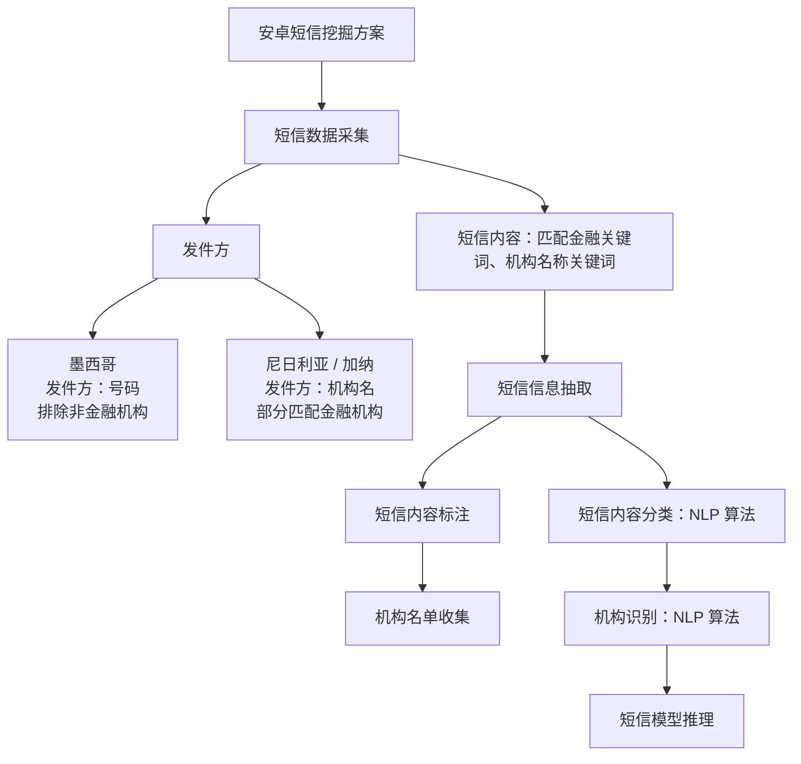

# AI 项目汇报内容

## 2.1 APP List（7）

### 0. PPT 大纲

#### 第一页：APP 标注的价值

**标题：海量且快速变化的 APP List，只有被持续标注才能转化为用户洞察**

##### 1. 核心观点

APP List 包含丰富的用户行为信息，但原始 APP 名称和包名无法直接用于变量挖掘。由于 APP 数量大、更新快，并且不同国家的 APP 生态差异明显，必须建立持续、稳定的信息抽取和标注能力。

##### 2. 数据展示：突出难点与痛点

- 已覆盖 4 个国家：墨西哥、加纳、尼日利亚、澳大利亚
- 全量去重 APP 数量达到【待补充】万个
- 每月新增 APP 约【待补充】个
- 约 50% 的 APP 在 Google Play 中无法找到或已经下架
- 人工标注效率约为 300 个/天

##### 3. 标注价值

```text
原始 APP List
→ APP 类别与功能识别
→ 用户行为和需求理解
→ APP 变量挖掘
→ 模型及业务应用
```

**信息抽取示例**

- 原始信息：APP 名称、包名
- 抽取结果：金融类 APP、小额借贷场景、短期资金需求
- 后续应用：形成信贷需求强度等候选变量

**结论：**  
APP 标注不是一次性的数据整理，而是一项需要跨市场复用、持续更新的数据能力。

---

#### 第二页：大模型解决方案

**标题：大模型将人工识别升级为可复用的批量推理流程**

##### 1. 核心观点

通过整合定时采集任务和人工标注经验，由大模型进行批量推理，再结合规则校验和人工抽检，可以显著提升标注效率、一致性和跨国家复用能力。

##### 2. 流程展示

【待补充：放置当前借助大模型进行 APP 标注的流程图】

##### 3. 方案对比

| 对比维度 | 人工方式 | 大模型增强方式 |
|---|---|---|
| 处理方式 | 逐个搜索和判断 | 批量推理 |
| 处理效率 | 较低 | 显著提升 |
| 标签口径 | 容易不一致 | 使用统一标签体系 |
| 疑难样本 | 依赖人工逐一判断 | 低置信度结果由人工复核 |
| 跨国家复用 | 新国家需要重复投入 | 主体流程可在多个国家复用 |

**结论：**  
大模型负责批量处理，规则保证底线，人工聚焦疑难样本。

---

#### 第三页：最终效果及业务价值

**标题：信息覆盖和生产效率同步提升，并转化为模型与业务收益**

##### 1. 核心观点

大模型信息抽取不仅提升了 APP 识别覆盖率和标注效率，还增加了可用于变量挖掘的信息，为模型效果和跨市场业务拓展提供支持。

##### 2. 数据生产效果

- 未识别 APP 比例从【待补充】%下降至【待补充】%
- 单批数据标注处理周期从【待补充】缩短至【待补充】
- 人工标注投入下降【待补充】%
- 人工抽样一致率或标注准确率达到【待补充】%

##### 3. 模型帮助

- 对模型 AUC 的增益：【待补充】
- 进入模型或策略的有效变量：【待补充】个
- APP 子模型的重要度：【待补充】

##### 4. 业务帮助

- 更快支持新国家和新产品的数据建设
- 减少重复人工调研和标注投入
- 快速洞察用户画像和潜在需求

**结论：**  
最终交付的不只是一批 APP 标签，而是一套能够跨市场复用、持续更新，并转化为模型变量和业务洞察的数据服务能力。

---

## 2.2 SMS（7）

### 2.2.1 第一页：标准化方案介绍

# 安卓短信挖掘方案



#### 短信信息抽取模型

##### 1. 部署方式

- 实时生成任务
- 流式调用模型

##### 2. 日新增数据量

| 国家 | 日新增短信量 |
|---|---:|
| 墨西哥 | 160 万 |
| 尼日利亚 | 390 万 |
| 加纳 | 60 万 |

##### 3. 当前痛点

模型迭代改造工作量较大，耗时较长，并占用较多资源，主要包括：

- 历史数据回溯
- 线上数据推送
- 线上任务调度

---

### 2.2.2 第二页：大模型与小模型对比

# 模型效果对比

| 模型 | 速率 | 费用 | 机构名称准确率 | 机构类型准确率 | 短信类型准确率 |
|---|---:|---:|---:|---:|---:|
| 大模型 | 1 分钟/条 | 2,000 条/元 | 61% | 83% | 77% |
| 小模型 | 60 ms/条 | — | 94% | 86% | 96% |

#### 对比结论

可从以下三个维度展示大模型和小模型的差异：

- **耗时：** 小模型推理速度明显更快，更适合高并发线上生产。
- **成本：** 大模型适合冷启动、规则探索和样本标注，但大规模持续调用成本较高。
- **准确率：** 小模型在机构名称识别、机构类型识别和短信类型识别上整体更优。

#### 推荐定位

```text
大模型：用于冷启动、标注、规则探索和疑难样本处理
小模型：用于高频、低成本、实时的生产化推理
```

---

### 2.2.3 第三页：各国家效果对比及业务重要性

#### 1. 各国家标准化方案落地周期

```text
墨西哥：3 个月
→ 尼日利亚：2 个月
→ 加纳：1 个月
→ 泰国：下一阶段展望
```

随着标准化方案和工具链逐步成熟，新国家的落地周期正在明显缩短。

从墨西哥的 3 个月，到尼日利亚的 2 个月，再到加纳的 1 个月，说明我们沉淀的不只是某个国家的短信规则，而是一套可以跨市场复用的方法和工具链。

#### 2. 各国家数据源重要性

- **墨西哥：** 短信目前是除征信外最重要的数据源。
- **尼日利亚 / 加纳：** 短信目前是最重要的数据源。
- **应用场景：** 以新客场景为例，对比各国家不同数据源的重要性。

# 各国家数据源分布

| 数据源 | 墨西哥 | 尼日利亚 | 加纳 |
|---|---:|---:|---:|
| 短信 | 23% | 62% | 59% |
| APP List | 10% | 25% | 13% |
| 基础信息 + 行为 | 4% | 11% | 28% |
| 征信 | 29% | 3% | — |
| 其他外部数据 | 34% | — | — |

#### 3. 泰国项目重点验证方向

- 多语言和本地短信模板的快速适配能力
- 已有标准化 Schema 是否可以直接复用
- 新国家是否能够进一步缩短落地周期
- 大模型冷启动和小模型生产化能否形成更标准的衔接流程
