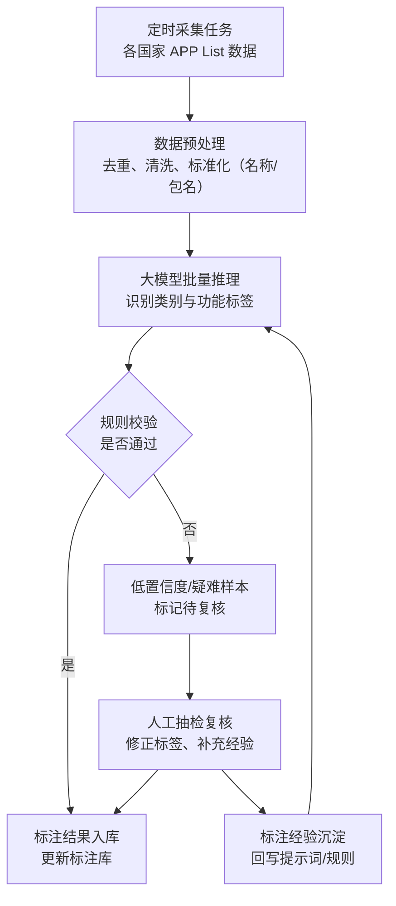
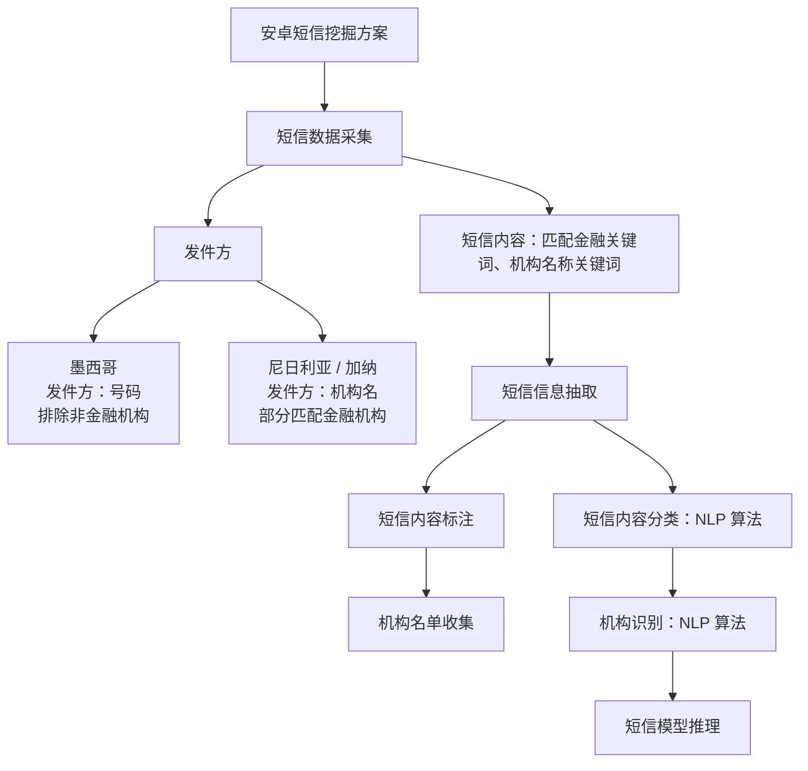

# AI 项目汇报：APP List 与短信挖掘（正文共 5 页，无封面）

请易编辑。不要生成大量小色块、卡片、标签、装饰线条或零碎文本框。每页控制主要元素数量。所有内容保持可编辑，视觉效果与编辑便利冲突时，优先方便后续修改。全篇正文共 5 页，不要封面页；每一页的内容尽量充实，已有数据一律保留、不得删减。

## 2.1 APP List（第 1-2 页）

### 第 1 页：APP 标注的价值——海量且快速变化的 APP List，只有被持续标注才能转化为用户洞察

#### 1. 核心观点

APP List 包含丰富的用户行为信息，但原始 APP 名称和包名无法直接用于变量挖掘。由于 APP 数量大、更新快，并且不同国家的 APP 生态差异明显，必须建立持续、稳定的信息抽取和标注能力。

#### 2. 数据现状：难点与痛点

- 已覆盖 4 个国家：墨西哥、加纳、尼日利亚、澳大利亚
- 全量去重 APP 数量达到【待补充】万个
- 每月新增 APP 约【待补充】个
- 约 50% 的 APP 在 Google Play 中无法找到或已经下架
- 人工标注效率约为 300 个/天

#### 3. 标注价值链路

```text
原始 APP List
→ APP 类别与功能识别
→ 用户行为和需求理解
→ APP 变量挖掘
→ 模型及业务应用
```

**信息抽取示例**

- 原始信息：APP 名称、包名
- 抽取结果：金融类 APP、小额借贷场景、短期资金需求
- 后续应用：形成信贷需求强度等候选变量

#### 4. 业务价值

- 更快支持新国家和新产品的数据建设
- 减少重复人工调研和标注投入
- 快速洞察用户画像和潜在需求

#### 5. 结论

APP 标注不是一次性的数据整理，而是一项需要跨市场复用、持续更新的数据能力。

---

### 第 2 页：大模型解决方案与效果——从人工识别升级为可复用的批量推理流程

#### 1. 核心观点

通过整合定时采集任务和人工标注经验，由大模型进行批量推理，再结合规则校验和人工抽检，可以显著提升标注效率、一致性和跨国家复用能力。

#### 2. 流程展示



#### 3. 方案对比

| 对比维度 | 人工方式 | 大模型增强方式 |
|---|---|---|
| 处理方式 | 逐个搜索和判断 | 批量推理 |
| 处理效率 | 较低 | 显著提升 |
| 标签口径 | 容易不一致 | 使用统一标签体系 |
| 疑难样本 | 依赖人工逐一判断 | 低置信度结果由人工复核 |
| 跨国家复用 | 新国家需要重复投入 | 主体流程可在多个国家复用 |

#### 4. 数据生产效果

- 未识别 APP 比例从【待补充】%下降至【待补充】%
- 单批数据标注处理周期从【待补充】缩短至【待补充】
- 人工标注投入下降【待补充】%
- 人工抽样一致率或标注准确率达到【待补充】%

#### 5. 对模型效果的帮助

- 对模型 AUC 的增益：【待补充】
- 进入模型或策略的有效变量：【待补充】个
- APP 子模型的重要度：【待补充】

#### 6. 结论

大模型负责批量处理，规则保证底线，人工聚焦疑难样本。最终交付的不只是一批 APP 标签，而是一套能够跨市场复用、持续更新，并转化为模型变量和业务洞察的数据服务能力。

---

## 2.2 SMS（第 3-5 页）

### 第 3 页：安卓短信挖掘标准化方案

#### 1. 方案总览



#### 2. 关键环节说明

- 发件方识别：墨西哥按号码识别、排除非金融机构；尼日利亚/加纳按机构名、部分匹配金融机构
- 短信内容识别：匹配金融关键词、机构名称关键词
- 短信信息抽取：内容标注 + 内容分类（NLP 算法）
- 机构识别：机构名单收集 + NLP 算法
- 短信模型推理：基于抽取结果推理短信类型与机构

#### 3. 部署方式

- 实时生成任务
- 流式调用模型

#### 4. 日新增数据量

| 国家 | 日新增短信量 |
|---|---:|
| 墨西哥 | 160 万 |
| 尼日利亚 | 390 万 |
| 加纳 | 60 万 |
| 合计 | 610 万 |

#### 5. 当前痛点

模型迭代改造工作量较大，耗时较长，并占用较多资源，主要包括：

- 历史数据回溯
- 线上数据推送
- 线上任务调度

以上环节相互依赖，任一环节改造都会拉长整体迭代周期，难以快速响应新规则和新场景需求。

---

### 第 4 页：大模型与小模型对比与衔接

#### 1. 模型效果对比

| 模型 | 速率 | 费用 | 机构名称准确率 | 机构类型准确率 | 短信类型准确率 |
|---|---:|---:|---:|---:|---:|
| 大模型 | 1 分钟/条 | 2,000 条/元 | 61% | 83% | 77% |
| 小模型 | 60 ms/条 | — | 94% | 86% | 96% |

#### 2. 对比结论

可从以下三个维度展示大模型和小模型的差异：

- **耗时：** 小模型推理速度明显更快，更适合高并发线上生产。
- **成本：** 大模型适合冷启动、规则探索和样本标注，但大规模持续调用成本较高。
- **准确率：** 小模型在机构名称识别、机构类型识别和短信类型识别上整体更优。

#### 3. 推荐定位

```text
大模型：用于冷启动、标注、规则探索和疑难样本处理
小模型：用于高频、低成本、实时的生产化推理
```

#### 4. 衔接闭环

```text
大模型冷启动（产出标注样本、沉淀规则）
→ 小模型训练与生产化（高频、低成本、实时推理）
→ 疑难样本回流大模型（持续迭代）
```

#### 5. 需要说明的关键点

- 小模型三项准确率均高于大模型，说明通用大模型推理不能直接替代精调小模型，两者是衔接关系而非替代关系。
- 大模型的核心价值在于冷启动阶段快速产出标注样本与规则，降低新国家、新场景的启动成本。

---

### 第 5 页：各国家效果对比及业务重要性

#### 1. 各国家标准化方案落地周期

```text
墨西哥：3 个月
→ 尼日利亚：2 个月
→ 加纳：1 个月
→ 泰国：下一阶段展望
```

随着标准化方案和工具链逐步成熟，新国家的落地周期正在明显缩短。

从墨西哥的 3 个月，到尼日利亚的 2 个月，再到加纳的 1 个月，说明我们沉淀的不只是某个国家的短信规则，而是一套可以跨市场复用的方法和工具链。

#### 2. 各国家数据源重要性

- **墨西哥：** 短信目前是除征信外最重要的数据源。
- **尼日利亚 / 加纳：** 短信目前是最重要的数据源。
- **应用场景：** 以新客场景为例，对比各国家不同数据源的重要性。

#### 3. 各国家数据源分布

| 数据源 | 墨西哥 | 尼日利亚 | 加纳 |
|---|---:|---:|---:|
| 短信 | 23% | 62% | 59% |
| APP List | 10% | 25% | 13% |
| 基础信息 + 行为 | 4% | 11% | 28% |
| 征信 | 29% | 3% | — |
| 其他外部数据 | 34% | — | — |

#### 4. 泰国项目重点验证方向

- 多语言和本地短信模板的快速适配能力
- 已有标准化 Schema 是否可以直接复用
- 新国家是否能够进一步缩短落地周期
- 大模型冷启动和小模型生产化能否形成更标准的衔接流程

#### 5. 小结

标准化方案已使短信挖掘从单一国家方案演变为跨市场复用的方法工具链，新国家落地周期由 3 个月缩短至 1 个月；泰国项目将验证多语言适配、Schema 复用与模型衔接流程，进一步降低新市场的启动成本。
