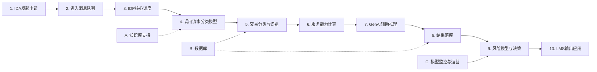

# 端到端流程与模型规划

## 第一部分：端到端流程

## 1. 申请接入

### 1. IDA发起申请
- 发起贷款申请与流水处理请求

### 2. 进入消息队列
- AWS SQS接收并排队任务

---

## 2. 流程编排

### 3. IDP核心调度
- 拉取申请、预处理数据、编排流程

### 4. 调用流水分类模型
- 调用 BS-CAT 分类能力

---

## 3. 核心计算

### 5. 交易分类与识别
- 输出交易分类、交易对手、分析标签

### 6. 服务能力计算
- S-CALC 执行收入 / 负债 / 支出等计算

### 7. GenAI辅助推理
- 处理复杂规则与补充判断

### 8. 结果落库
- 保存分类结果、HTM流水、测算结果

---

## 4. 决策输出

### 9. 风险模型与决策
- 结合画像与历史表现
- 输出评分 / 建议

### 10. LMS输出应用
- 向 LMS 返回推荐额度、质量标签、可视化结果

---

## 支撑能力

### A. 知识库支持
- 规则
- 关键词
- 第三方数据

### B. 数据库
- 申请数据
- 分类结果
- 服务能力结果

### C. 模型监控与运营
- 效果监控
- 异常跟踪
- 人工维护

---

## 流程关系

---

## 第二部分：模型部署与运维闭环

> **当前链路：**
> IDA读取银行流水数据 → BS-CAT 分类/指标输出 → 轻量 IDA serviceability 计算 → （如需针对异常申请二次判断）AI Agent 异常诊断 → 下游信审/风险/人审使用

## 1. 当前现状：已进入可调用阶段

**部署｜943 模型平台已完成部署**

模型已经具备线上单申请调用条件

**调用｜支持 IDA 开始链路联调**

Tien 本周推进调用与链路验证

**定位｜轻量 IDA 做"大脑调度"**

分类与大部分计算由模型输出，IDA 保持轻量

**这一版链路的核心取舍**

让分类模型输出"可直接用于信审"的核心结果；IDA 只保留必要的调度、汇总与基础计算，降低下游复杂度。

---

## 2. 运维怎么做：监控、定位、修复

### ① 调用跟踪

- application_id
- 成功率
- 耗时
- 版本
- 异常码

### ② 指标监控

- 分类分布
- 命中率
- 漂移
- 对手方异常
- 关键字段缺失

### ③ AI Agent 诊断

按交易描述、金额、方向、对手方与分类依据逐笔定位

### ④ 修复沉淀

规则、知识库、阈值、冲突优先级进入版本管理

### ⑤ 回归验证

抽样复核 + 周度诊断报告 + 线上效果对比

> **专人跟踪：**
> 上线后由同事持续跟进调用日志、异常 Case、监控报告与修复清单。

---

## 3. 下游调用方与近期分工

### IDA

**负责人：Tien / Niral**

负责链路调用、调度逻辑、基础计算与 IDA 代码落地

### 风险 / 模型

**负责人：Risk & Model**

使用分类、负债、收入、支出与 Serviceability 相关指标

### 人审

**负责人：SAV**

用于 Case 复核、异常解释、质检样本与业务反馈闭环

---

## 近期节奏

| 时间 | 事项                         |
| ---- | ---------------------------- |
| 本周 | Tien 开始做 IDA 链路调用     |
| 下月 | Niral 开始写 IDA 代码        |
| 持续 | 周度监控、问题清单、修复回归 |

---

## 目标

**从"模型能被调用"升级为"可监控、可定位、可修复、可沉淀"的生产级分类能力。**
