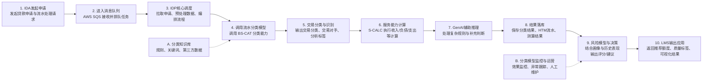

# 端到端流程与模型规划

## 第一部分：端到端流程

## 流程关系

**这一版链路的核心取舍**

让分类模型输出"可直接用于信审"的核心结果；IDA 只保留必要的调度、汇总与基础计算，降低下游复杂度。
---

## 第二部分：模型部署与运维闭环

## 1. 当前现状：已进入可调用阶段

**部署与联调｜943 模型平台已完成部署，模型具备线上单申请调用条件；支持 IDA 开始链路联调**

**下游分工**

| 调用方 | 负责人 | 职责 |
| ------ | ------ | ---- |
| IDA | Tien / Niral | 链路调用、调度逻辑、Serviceability计算与 IDA/IDP 代码落地 |
| 风险 / 模型 | Risk & Model | 使用分类、负债、收入、支出与 Serviceability 指标 |
| 人审 | SAV | Case 复核、异常解释、质检样本与业务反馈闭环 |

**近期节奏**

| 时间 | 事项 |
| ---- | ---- |
| 本周 | Tien 开始做 IDA 链路调用 |
| 下月 | Niral 开始写 IDA 代码 |
| 持续 | 周度监控、问题清单、修复回归 |

---

## 2. 运维怎么做：监控、定位、修复

**1 人 + 2 个 AI Agent，形成“监控 → 定位 → 修复 → 沉淀”的持续运维闭环。**

### AI Agent 1｜质检 Agent：监控异常、定位问题

自动跟踪线上调用与分类效果，识别异常 Case，并定位具体问题来源。

#### ① 调用监控

* Application ID / 模型版本
* 调用成功率 / 耗时
* 异常码 / 失败原因

#### ② 效果监控

* 分类分布与命中率
* 数据 / 分类漂移
* 对手方识别异常
* 关键字段缺失

#### ③ 问题诊断

* 定位异常交易与问题引擎
* 识别缺失商户 / 关键词 / 规则
* 自动生成**优先级 Todo 清单**

---

### AI Agent 2｜知识库 Agent：主动补充、持续迭代

针对质检 Agent 发现的问题，主动获取外部信息并更新知识库，将线上问题持续沉淀为模型能力。

#### ① 知识补全

* 主动检索未知商户 / 对手方
* 补充企业、品牌、关键词与分类信息
* 识别新增或变化的业务实体

#### ② 知识校验

* 交叉验证分类与商户信息
* 识别冲突、过期及低置信知识
* 输出待人工确认项

#### ③ 知识库更新

* 自动生成新增 / 修改建议
* 人工审核后进入正式知识库
* 持续沉淀规则、案例与分类依据

---

